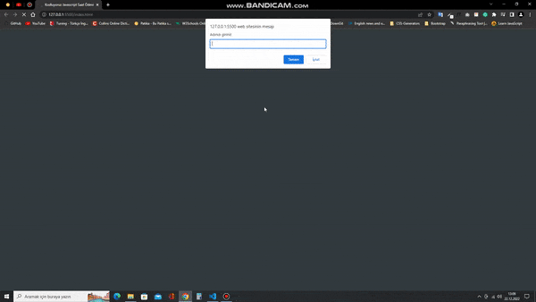

# JavaScript Ödev-1

## Saat, Gün ve Karşılama
Girişte prompt ile isim isteyip sonra bu ismi karşılama ekranına yerleştirerek o anki saati ve günü gösteren bir ekran.

## İçindekiler
* index.html
* style.css
* clock.js
* README.md
* img/

    